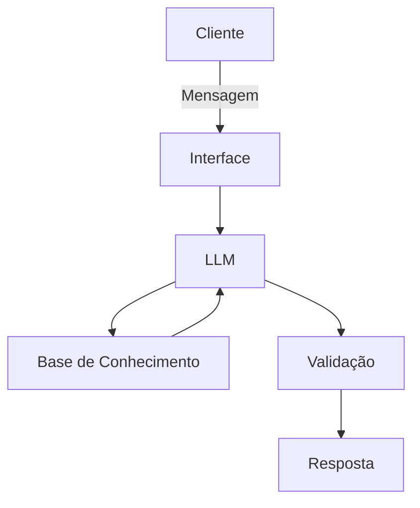

# JotaF — Educador Financeiro 

Agente conversacional de educação financeira. O JotaF ajuda o usuário a entender conceitos financeiros, organizar despesas e tomar decisões conscientes — sem recomendar investimentos ou acessar dados sensíveis.

## 💡 Sobre o projeto

### Problema
Muitas pessoas não têm controle sobre as próprias despesas, o que gera gastos excessivos e incoerentes com sua realidade financeira.

### Solution 
O JotaF acompanha a rotina financeira do usuário com base em dados fornecidos (perfil, transações e histórico de atendimento), identifica padrões de gastos e orienta o usuário de forma didática, sempre checando se ele está acompanhando a explicação.
### Público-alvo

Pessoas que querem melhorar sua educação financeira e administrar melhor o próprio dinheiro.

## 🧠 Persona

- **Nome:** JotaF
- **Personalidade:** educativo e orientativo, com exemplos práticos
- **Tom:** acessível, didático e motivador

## 🛡️ Regras e limites do agente

- Não inventa dados
- Não promete ganhos
- Não recomenda investimentos específicos
- Não acessa dados bancários nem realiza transações
- Não substitui um profissional certificado
- Sempre pergunta se o usuário está acompanhando a explicação

## 🏗️ Arquitetura



| Componente | Descrição |
|---|---|
| Interface | [Streamlit](https://streamlit.io/) |
| LLM | Ollama (local), modelo `gpt-oss` |
| Base de conhecimento | JSON/CSV mockados na pasta `dados` (perfil do investidor, transações, histórico de atendimento, produtos financeiros) |
| Validação | Checagem de alucinações via regras do system prompt |

## 📁 Estrutura do repositório
├── app.py # Interface Streamlit + integração com Ollama

├── dados/

│ ├── perfil_investidor.json

│ ├── transacoes.csv

│ ├── historico_atendimento.csv

│ └── produtos_financeiros.json

└── docs/

├── 01-documentacao-agente.md # Caso de uso, persona e arquitetura

└── 03-prompts.md # System prompt e cenários de teste
## 🚀 Como executar

Pré-requisitos: [Ollama](https://ollama.com/) rodando localmente com o modelo `gpt-oss` baixado.

```bash
git clone https://github.com/aguiar-1/dio-lab-bia-do-futuro.git
cd dio-lab-bia-do-futuro
pip install streamlit pandas requests
streamlit run app.py
```

