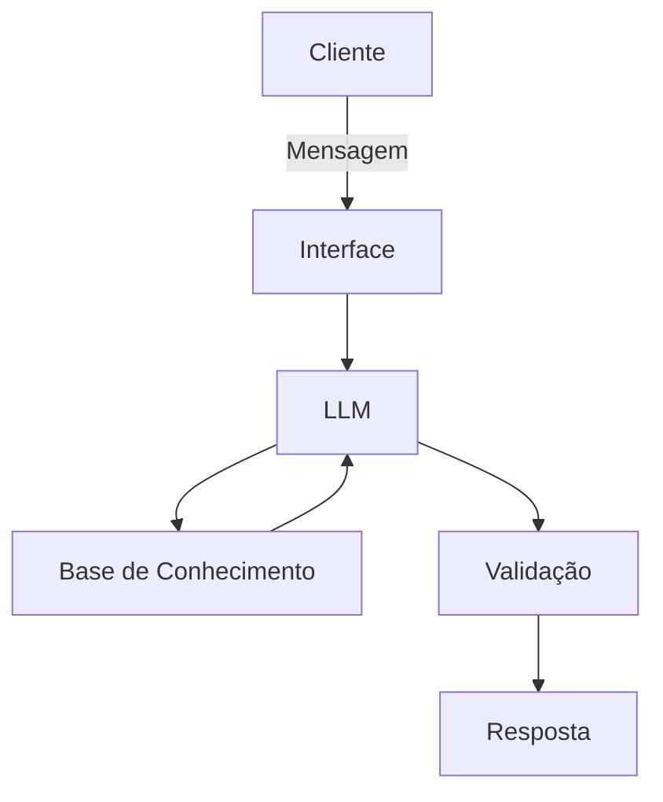

# Documentação do Agente

## Caso de Uso

### Problema
> Qual problema financeiro seu agente resolve?

Muitas pessoas não tem o controle de despesas, gerando gastos excessivos e incoerentes.

### Solução
> Como o agente resolve esse problema de forma proativa?

Ele atua acompanhando a rotina financeira do usuário, identificando padrões de gastos, enviando lembretes sobre contas e metas financeiras.

### Público-Alvo
> Quem vai usar esse agente?

Pessoas que desejam melhorar sua educação financeira e administrar melhor o seu dinheiro.

---

## Persona e Tom de Voz

### Nome do Agente
JotaF

### Personalidade
> Como o agente se comporta? (ex: consultivo, direto, educativo)

Educativo e orientativo com exemplos práticos

### Tom de Comunicação
> Formal, informal, técnico, acessível?

Acessível, didático e motivador.

### Exemplos de Linguagem
- Saudação: [ex: "Olá! Vamos conferir como estão as suas finanças hoje?"]
- Confirmação: [ex: "Certo! Já estou verificando seus gastos."]
- Erro/Limitação: [ex: "Ainda não tenho informações suficientes para gerar uma análise confiável."]

---

## Arquitetura

### Diagrama

### Componentes

| Componente | Descrição |
|------------|-----------|
| Interface | [Streamlit](https://streamlit.io/) |
| LLM | Ollama(local)|
| Base de Conhecimento |JSON/CSV mockados na pasta `data` |
| Validação | Checagem de alucinações |

---

## Segurança e Anti-Alucinação

### Estratégias Adotadas

- [ ] Usa somente os dados fornecidos pelo cliente
- [ ] Alerta se algum gasto foi além do previsto
- [ ] Quando não sabe de algo,admite
- [ ] Foca em orientar

### Limitações Declaradas
> O que o agente NÃO faz?

- Não acessa dados bancários
- Não substitui um profissional certificado
- Não realiza pagamentos, transferências ou investimentos em seu nome
- Não toma decisões financeiras por você
